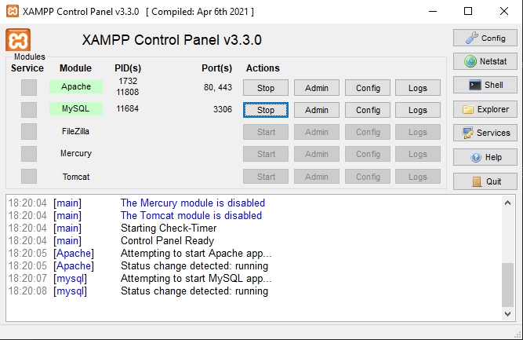

# TrabGABD2

Trabalho da cadeira Sistemas de Gerência de Banco de Dados – SGBD.
## Integrantes
    Pedro Henrique
    Leonardo Terragno
    Gustavo Bedin Odriozola
## Como executar

Para o servidor instalar o XAMPP (https://www.apachefriends.org/pt_br/index.html).

No painel de controle inicar o Apache e mySQL

Vá até o localhost e na aba phpMyAdmin, clique em SQL e crie uma base de dados com nome trabga (CREATE DATABASE trabga)

Importe o projeto Maven para a IDE de escolha e rode o arquivo em src/main/aplicacao/Programa.java
